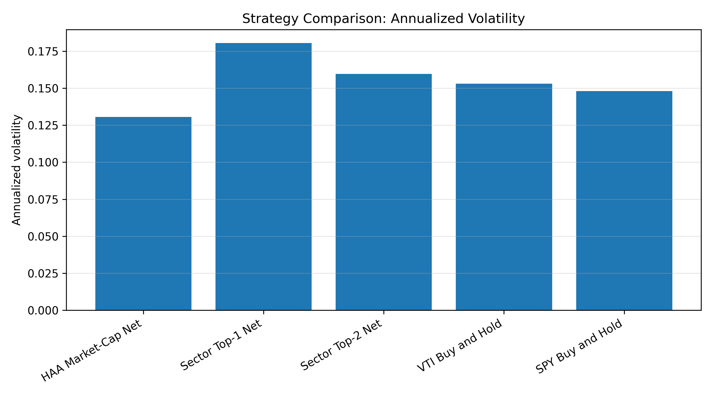
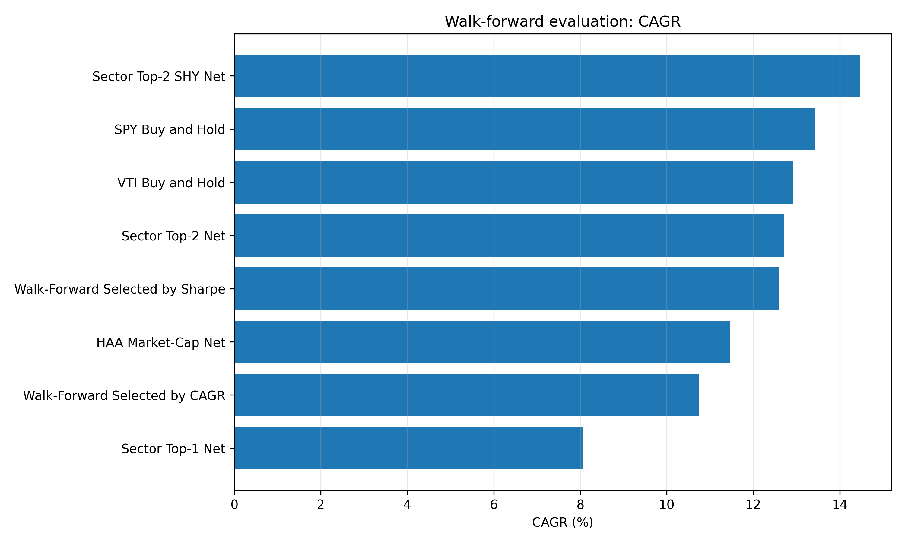
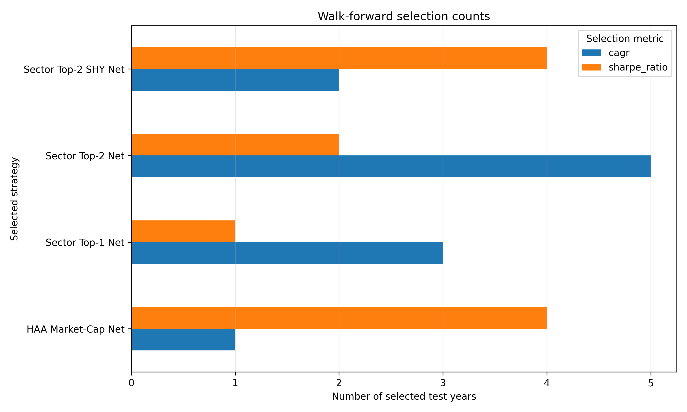
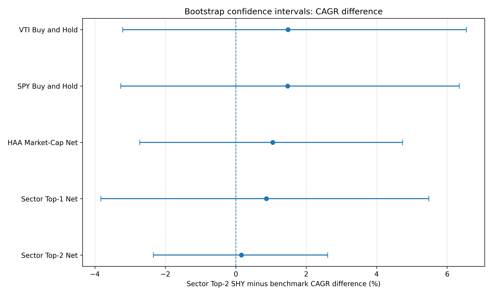
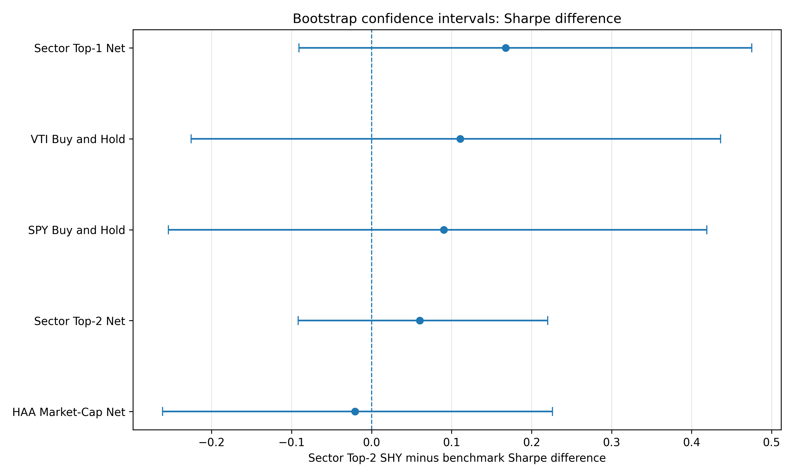
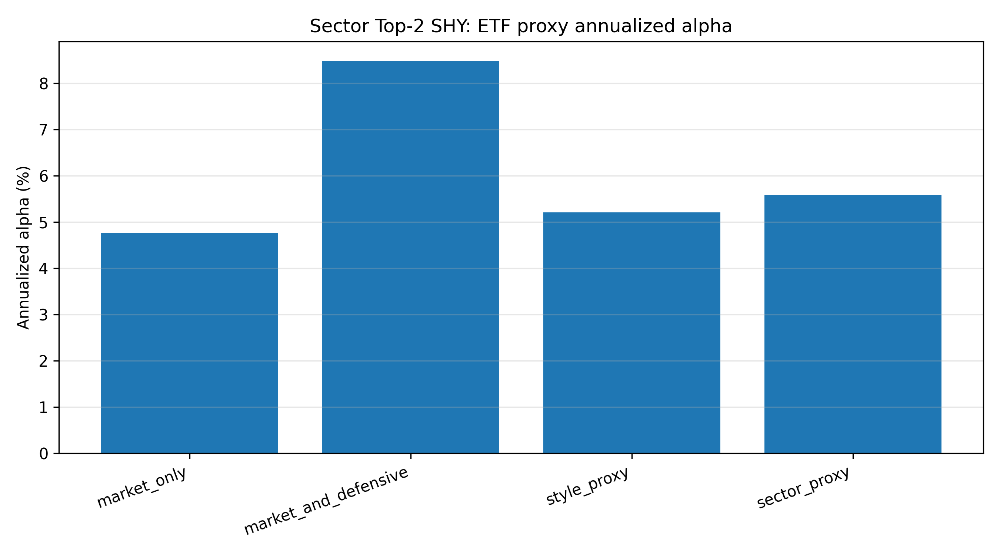
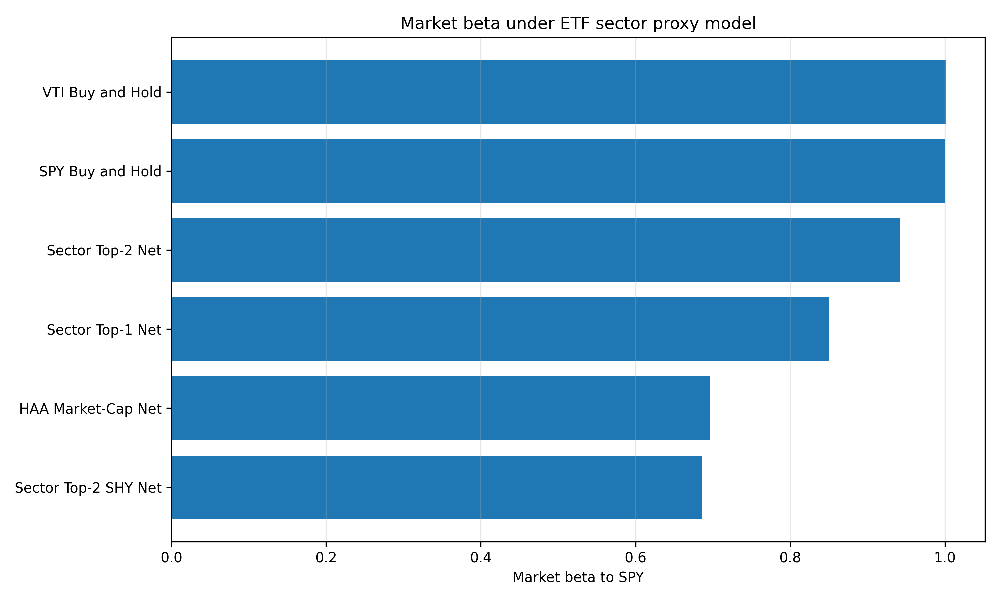

# Regime-Aware Sector Rotation with Momentum and Canary Assets

This repository is an empirical research project on regime-aware ETF allocation.

It starts from a Hybrid Asset Allocation-style framework using momentum and a canary asset, then tests whether the same logic can be extended from market-cap rotation to sector rotation. The project is deliberately written as a research note rather than as a trading recommendation: the central question is not whether a single backtest looks good, but whether the result survives more honest validation checks.

---

## Abstract

This project studies whether a regime-aware momentum strategy can improve the risk-adjusted profile of a U.S. equity allocation. The baseline replicates a Hybrid Asset Allocation-style market-cap rotation rule using `TIP` as a canary asset, `SPY`, `MDY`, and `IJR` as offensive assets, `SHY` as the defensive asset, and `VTI` / `SPY` as equity benchmarks.

The project then extends the framework to U.S. sector ETFs. The best full-sample sector variant, `Sector Top-2 SHY Net`, allocates to the two strongest offensive sectors in risk-on regimes and switches fully to `SHY` in risk-off regimes.

The full-sample results are favorable: `Sector Top-2 SHY Net` achieves the highest CAGR among the tested rules, with lower drawdown than buy-and-hold equity benchmarks. However, the project also shows that in-sample model selection is unstable. A rolling walk-forward selection rule does not consistently recover the full-sample winner. Bootstrap confidence intervals also suggest that the raw return advantage over `SPY` and `VTI` is not statistically decisive.

The strongest empirical result is therefore more nuanced: the defensive sector rotation rule improves the risk profile of sector momentum strategies and keeps a positive ETF proxy factor alpha, but it should not be interpreted as proof of a uniquely optimal trading rule.

## Relation to the Reference Paper

This repository starts from Peter B. Richman’s paper, *A Regime-Aware Market Capitalization Rotation Strategy Using Hybrid Asset Allocation Momentum*. The paper applies a Hybrid Asset Allocation-style momentum framework to U.S. market-capitalization rotation, using `SPY`, `MDY`, and `IJR` as offensive assets, `TIP` as the canary asset, `SHY` as the defensive allocation, and `VTI` as the benchmark.

The first objective of this repository is to reproduce the core logic of that market-cap rotation framework in Python. The second objective is to extend the same regime-aware architecture to U.S. sector ETFs. Instead of rotating only between large-, mid-, and small-cap equity segments, the extension tests whether sector-level momentum can improve the risk-return profile of the strategy.

The contribution of this repository is therefore not the invention of the HAA framework itself. The contribution is the empirical extension from market-cap rotation to sector rotation, together with additional robustness diagnostics: walk-forward model selection, paired block bootstrap inference, canary sensitivity analysis, and ETF proxy factor regressions.

---

## 1. Research Question

The project asks:

> Can a regime-aware momentum strategy improve risk-adjusted performance and drawdown control compared with buy-and-hold equity benchmarks?

More specifically, it studies four questions:

1. Can a HAA-style market-cap rotation strategy be replicated in Python?
2. Does sector-level momentum improve performance relative to market-cap rotation?
3. Does a more defensive risk-off allocation improve drawdown control?
4. Are the results robust to walk-forward model selection, bootstrap inference, and ETF proxy factor exposure tests?

---

## 2. Strategy Design

### 2.1 Momentum Signal

The core signal is a 13612 momentum score:

```math
M_t = \frac{1}{4}\left(R_{1m,t} + R_{3m,t} + R_{6m,t} + R_{12m,t}\right),
```

where `R_{h,t}` is the trailing total return over `h` months.

The signal is computed at month-end and applied to the following month. This avoids direct look-ahead bias.

---

### 2.2 Canary Asset

A canary asset is used as a regime proxy.

The baseline canary is `TIP`.

If canary momentum is positive, the strategy is in a risk-on regime:

```math
M_t(\text{canary}) > 0.
```

If canary momentum is non-positive, the strategy is in a risk-off regime:

```math
M_t(\text{canary}) \leq 0.
```

---

### 2.3 Transaction Costs

Transaction costs are applied using one-way portfolio turnover:

```math
\text{turnover}_t = \frac{1}{2} \sum_i |w_{t,i} - w_{t-1,i}|.
```

Net returns are computed as:

```math
r^{net}_t = r^{gross}_t - c \times \text{turnover}_t,
```

where `c` is the transaction cost rate.

The baseline transaction cost assumption is 5 basis points per unit of one-way turnover.

---

## 3. Strategies Tested

### 3.1 HAA Market-Cap Replication

The market-cap replication uses:

* `TIP` as the canary asset;
* `SPY`, `MDY`, and `IJR` as offensive assets;
* `SHY` as the defensive asset;
* `VTI` as benchmark.

Rule:

* Risk-on: invest 100% in the strongest asset among `SPY`, `MDY`, and `IJR`.
* Risk-off: invest 100% in `SHY`.

---

### 3.2 Sector Top-1

The first sector extension uses:

* Offensive sectors: `XLK`, `XLY`, `XLI`, `XLF`, `XLE`;
* Defensive assets: `XLP`, `XLU`, `XLV`, `SHY`.

Rule:

* Risk-on: invest 100% in the strongest offensive sector.
* Risk-off: invest 100% in the strongest defensive asset.

---

### 3.3 Sector Top-2

The second sector extension reduces concentration.

Rule:

* Risk-on: invest 50% in each of the two strongest offensive sectors.
* Risk-off: invest 50% in each of the two strongest defensive assets.

---

### 3.4 Sector Top-2 SHY

The final sector extension uses a more defensive risk-off rule.

Rule:

* Risk-on: invest 50% in each of the two strongest offensive sectors.
* Risk-off: invest 100% in `SHY`.

This is the strongest full-sample sector variant.

---

## 4. Data

The project uses monthly ETF data downloaded with `yfinance`.

Backtest period:

* January 2005 to December 2025.

Main assets:

| Ticker | Role                                            |
| ------ | ----------------------------------------------- |
| `TIP`  | Baseline canary asset                           |
| `SPY`  | Large-cap equity ETF and benchmark              |
| `MDY`  | Mid-cap equity ETF                              |
| `IJR`  | Small-cap equity ETF                            |
| `SHY`  | Short-duration Treasury ETF and defensive asset |
| `VTI`  | Total U.S. equity benchmark                     |
| `XLK`  | Technology sector                               |
| `XLY`  | Consumer discretionary sector                   |
| `XLI`  | Industrials sector                              |
| `XLF`  | Financials sector                               |
| `XLE`  | Energy sector                                   |
| `XLP`  | Consumer staples sector                         |
| `XLU`  | Utilities sector                                |
| `XLV`  | Health care sector                              |

---

## 5. Full-Sample Results

Backtest period: January 2005 to December 2025.
Frequency: monthly.
Transaction costs: 5 basis points.

| Strategy             | Total Return |   CAGR | Volatility | Sharpe | Max Drawdown | Avg. Turnover |
| -------------------- | -----------: | -----: | ---------: | -----: | -----------: | ------------: |
| HAA Market-Cap Net   |      801.56% | 11.04% |     13.06% |   0.87 |      -25.83% |        35.32% |
| Sector Top-1 Net     |      832.74% | 11.22% |     18.06% |   0.68 |      -34.25% |        44.05% |
| Sector Top-2 Net     |      965.97% | 11.93% |     15.97% |   0.79 |      -40.67% |        32.94% |
| Sector Top-2 SHY Net |      998.13% | 12.09% |     14.79% |   0.85 |      -31.56% |        28.77% |
| VTI Buy and Hold     |      730.20% | 10.60% |     15.31% |   0.74 |      -50.84% |             — |
| SPY Buy and Hold     |      731.68% | 10.61% |     14.81% |   0.76 |      -50.78% |             — |

The full-sample ranking favors `Sector Top-2 SHY Net` by CAGR. It also produces materially lower drawdown than `SPY` and `VTI`.

However, full-sample performance is not sufficient evidence of a robust allocation rule. The remainder of the project therefore focuses on model selection, bootstrap inference, and factor exposure diagnostics.

---

## 6. Full-Sample Figures

### Cumulative Performance


### Drawdowns


### CAGR


### Volatility



### Sharpe Ratio


### Maximum Drawdown


---

## 7. Out-of-Sample Split

A first diagnostic split evaluates strategies over:

* In-sample: January 2005 to December 2015;
* Out-of-sample: January 2016 to December 2025.

| Strategy             | OOS CAGR | OOS Volatility | OOS Sharpe | OOS Max Drawdown |
| -------------------- | -------: | -------------: | ---------: | ---------------: |
| HAA Market-Cap Net   |   12.73% |         12.33% |       1.04 |          -19.45% |
| Sector Top-1 Net     |    9.01% |         16.76% |       0.60 |          -22.83% |
| Sector Top-2 Net     |   13.91% |         15.43% |       0.92 |          -19.95% |
| Sector Top-2 SHY Net |   15.66% |         13.83% |       1.13 |          -19.95% |
| VTI Buy and Hold     |   14.25% |         15.59% |       0.94 |          -24.82% |
| SPY Buy and Hold     |   14.72% |         15.08% |       0.99 |          -23.93% |

The split produces a key warning: the in-sample ranking is not preserved out of sample. `Sector Top-1 Net` is the strongest strategy in sample by CAGR, while it becomes the weakest strategy out of sample. `Sector Top-2 SHY Net` performs very well out of sample, but it was not the in-sample winner.

This means that the out-of-sample result should be read as a diagnostic, not as a clean validation of the full-sample winner.

---

## 8. Walk-Forward Model Selection

To avoid interpreting the best full-sample strategy as if it had been selected in real time, the project implements a rolling walk-forward validation.

For each test year from 2015 to 2025:

1. The previous ten years are used as a training window.
2. The best strategy is selected in-sample using either Sharpe ratio or CAGR.
3. The selected strategy is held during the following calendar year.
4. The process is repeated through 2025.

### Walk-Forward Performance

| Strategy                        | Total Return |   CAGR |
| ------------------------------- | -----------: | -----: |
| Walk-Forward Selected by Sharpe |      268.79% | 12.60% |
| Walk-Forward Selected by CAGR   |      207.04% | 10.74% |
| HAA Market-Cap Net              |      230.23% | 11.47% |
| Sector Top-1 Net                |      134.49% |  8.06% |
| Sector Top-2 Net                |      273.25% | 12.72% |
| Sector Top-2 SHY Net            |      342.16% | 14.47% |
| VTI Buy and Hold                |      280.30% | 12.91% |
| SPY Buy and Hold                |      299.53% | 13.42% |

The fixed `Sector Top-2 SHY Net` rule remains the strongest strategy over the 2015–2025 evaluation period. However, the honest walk-forward selection rule based on Sharpe reaches only 12.60% CAGR, and the rule based on CAGR reaches only 10.74% CAGR.

This shows that the full-sample winner is not trivially recovered by an ex-ante model-selection procedure.

### Walk-Forward Selection Pattern

Under Sharpe-based selection:

* 2015: `Sector Top-1 Net`;
* 2016–2019: `HAA Market-Cap Net`;
* 2020–2021: `Sector Top-2 Net`;
* 2022–2025: `Sector Top-2 SHY Net`.

Under CAGR-based selection:

* 2015–2017: `Sector Top-1 Net`;
* 2018: `HAA Market-Cap Net`;
* 2019–2023: `Sector Top-2 Net`;
* 2024–2025: `Sector Top-2 SHY Net`.

The walk-forward exercise therefore gives a more nuanced conclusion: `Sector Top-2 SHY Net` is attractive as a fixed rule, but the timing of strategy selection remains unstable.

### Walk-Forward Figures





---

## 9. Bootstrap Significance Analysis

The project runs a paired circular block bootstrap to evaluate whether the observed performance differences are statistically robust.

Bootstrap setup:

* Target strategy: `Sector Top-2 SHY Net`;
* Number of bootstrap samples: 10,000;
* Block length: 6 months;
* Metrics: CAGR difference, annualized return difference, volatility difference, Sharpe difference, and mean monthly excess return.

### Bootstrap Results

Against `SPY` and `VTI`, `Sector Top-2 SHY Net` has positive observed performance differences:

| Benchmark          | CAGR Difference | Sharpe Difference | Interpretation                    |
| ------------------ | --------------: | ----------------: | --------------------------------- |
| SPY Buy and Hold   |          +1.47% |            +0.090 | Confidence intervals include zero |
| VTI Buy and Hold   |          +1.48% |            +0.111 | Confidence intervals include zero |
| HAA Market-Cap Net |          +1.05% |            -0.021 | Confidence intervals include zero |
| Sector Top-2 Net   |          +0.16% |            +0.060 | Confidence intervals include zero |
| Sector Top-1 Net   |          +0.87% |            +0.168 | Confidence intervals include zero |

The raw return and Sharpe improvements are positive in several cases, but the bootstrap confidence intervals generally include zero. Therefore, the return advantage should not be interpreted as statistically conclusive.

The strongest bootstrap result is risk-based:

* `Sector Top-2 SHY Net` has significantly lower volatility than `Sector Top-2 Net`.
* `Sector Top-2 SHY Net` has significantly lower volatility than `Sector Top-1 Net`.
* `Sector Top-2 SHY Net` is significantly more volatile than `HAA Market-Cap Net`.

This confirms that `HAA Market-Cap Net` remains the more defensive allocation rule, while `Sector Top-2 SHY Net` improves the volatility profile of the sector rotation variants.

### Bootstrap Figures





---

## 10. ETF Proxy Factor Exposure Analysis

The project also runs a lightweight ETF proxy factor exposure analysis.

This is not a formal Fama-French factor model. It is a diagnostic regression using ETF-based proxies already available in the dataset.

The proxy models include:

* `MKT_SPY`: broad equity market exposure;
* `SHY`: short-duration Treasury exposure;
* `SIZE_IJR_MINUS_SPY`: small-cap proxy;
* `MID_MDY_MINUS_SPY`: mid-cap proxy;
* `TIP_MINUS_SHY`: inflation-linked bond proxy;
* `OFFENSIVE_SECTORS_MINUS_SPY`: offensive sector basket proxy;
* `DEFENSIVE_SECTORS_MINUS_SPY`: defensive sector basket proxy.

### Sector Top-2 SHY Factor Results

| Model              | Annualized Alpha | Alpha t-stat |    R² | Market Beta |
| ------------------ | ---------------: | -----------: | ----: | ----------: |
| Market only        |            4.76% |         2.00 | 0.483 |       0.694 |
| Market + defensive |            8.48% |         3.40 | 0.514 |       0.674 |
| Style proxy        |            5.20% |         2.30 | 0.541 |       0.763 |
| Sector proxy       |            5.58% |         2.52 | 0.565 |       0.685 |

The results suggest that `Sector Top-2 SHY Net` is not simply a disguised high-beta equity exposure. Its market beta remains below one, and the estimated intercept remains positive across proxy specifications.

The interpretation should remain conservative. These ETF proxy regressions do not prove the existence of a persistent anomaly. They indicate that the strategy's performance is not fully explained by passive equity exposure alone, and that the allocation mechanism appears to contribute meaningfully to the return profile.

### Factor Exposure Figures





---

## 11. Canary Robustness

The project tests whether `Sector Top-2 SHY Net` is sensitive to the choice of canary asset.

Tested canaries:

* `TIP`;
* `SPY`;
* `VTI`;
* `SHY`.

| Canary |   CAGR | Volatility | Sharpe | Max Drawdown | Risk-On Frequency |
| ------ | -----: | ---------: | -----: | -----------: | ----------------: |
| TIP    | 12.09% |     14.79% |   0.85 |      -31.56% |            75.40% |
| SPY    | 11.69% |     12.67% |   0.94 |      -20.25% |            83.33% |
| VTI    | 10.72% |     12.50% |   0.88 |      -20.25% |            81.75% |
| SHY    | 10.58% |     16.46% |   0.70 |      -54.21% |            85.32% |

The strategy is sensitive to the regime proxy.

`TIP` produces the highest CAGR and remains the baseline because it is aligned with the original HAA-style framework. `SPY` gives the best Sharpe ratio and drawdown control. `SHY` performs poorly as a canary, even though it is useful as a defensive asset.

This suggests that a defensive asset is not necessarily a good regime proxy.

### Canary Robustness Figures


---

## 12. Main Findings

The project leads to five main findings.

First, the HAA-style market-cap replication is a strong defensive benchmark. It has the best Sharpe ratio in the full-sample comparison and the lowest maximum drawdown among the baseline strategies.

Second, naive sector rotation increases return potential but also introduces concentration risk and higher drawdowns.

Third, the `Sector Top-2 SHY Net` variant is the strongest full-sample sector extension. It preserves sector momentum exposure in favorable regimes while using `SHY` as a clean risk-off allocation.

Fourth, the strategy selection problem is real. The full-sample winner is not automatically recovered by a rolling walk-forward selection rule. This limits the strength of any claim based only on full-sample performance.

Fifth, the statistical evidence is mixed but useful. Bootstrap confidence intervals do not establish decisive raw outperformance over `SPY` or `VTI`. However, ETF proxy regressions suggest that `Sector Top-2 SHY Net` retains a positive intercept after controlling for broad market and proxy factor exposures.

---

## 13. Limitations

This is a research and educational backtest. It has several limitations.

* ETF data are downloaded from `yfinance`, which may differ from institutional total-return datasets.
* The strategy ignores taxes, management fees, bid-ask spreads, and market impact beyond simple transaction costs.
* Transaction costs are modeled as a flat 5 basis points per unit of one-way turnover.
* The universe is limited to liquid U.S. ETFs.
* The sample begins in 2005, which limits the number of independent market regimes.
* The canary signal is binary and based only on momentum.
* The sector definitions are fixed and may not capture changing sector composition over time.
* The ETF proxy factor regressions are diagnostic, not a formal asset-pricing model.
* Bootstrap confidence intervals depend on the block length assumption.
* The results are historical and should not be interpreted as investment advice.

---

## 14. Possible Extensions

Potential extensions include:

1. Rolling walk-forward optimization of the canary asset.
2. Markov-smoothed regime probabilities instead of a binary risk-on / risk-off signal.
3. Volatility-scaled sector allocation.
4. Top-3 sector allocation.
5. Drawdown-aware or CVaR-aware allocation rules.
6. Alternative canaries such as credit spreads, yield curve slope, inflation breakevens, or macro indicators.
7. Formal Fama-French factor regressions using external factor datasets.
8. White Reality Check or Deflated Sharpe Ratio for multiple-testing adjustment.
9. Stress-period analysis around 2008, 2020, and 2022.
10. A fully reproducible notebook or report export.

---

## 15. Repository Structure

```text
regime-aware-sector-rotation/
├── README.md
├── requirements.txt
├── data/
├── figures/
└── src/
    ├── common/
    │   ├── data.py
    │   ├── metrics.py
    │   └── plots.py
    └── haa/
        ├── momentum.py
        ├── replication.py
        ├── sector_rotation.py
        ├── sector_rotation_topk.py
        ├── sector_rotation_top2_shy.py
        ├── compare_strategies.py
        ├── oos_validation.py
        ├── walk_forward_validation.py
        ├── bootstrap_significance.py
        ├── factor_exposure_analysis.py
        ├── robustness_canary.py
        ├── plot_robustness_canary.py
        └── plot_research_diagnostics.py
```

---

## 16. How to Run

### 16.1 Install Dependencies

```bash
pip install -r requirements.txt
```

### 16.2 Run the Full Research Pipeline

```bash
python src/common/data.py && \
python src/haa/replication.py && \
python src/haa/sector_rotation.py && \
python src/haa/sector_rotation_topk.py && \
python src/haa/sector_rotation_top2_shy.py && \
python src/haa/compare_strategies.py && \
python src/haa/oos_validation.py && \
python src/haa/walk_forward_validation.py && \
python src/haa/bootstrap_significance.py && \
python src/haa/factor_exposure_analysis.py && \
python src/haa/robustness_canary.py && \
python src/haa/plot_robustness_canary.py && \
python src/haa/plot_research_diagnostics.py
```

Using `&&` ensures that the pipeline stops if one step fails.

### 16.3 Main Output Files

```text
data/strategy_comparison_returns.csv
data/strategy_comparison_summary.csv
data/oos_validation_summary.csv
data/walk_forward_returns.csv
data/walk_forward_selection.csv
data/walk_forward_summary.csv
data/bootstrap_significance_summary.csv
data/factor_regression_summary.csv
data/robustness_canary_summary.csv
```

### 16.4 Main Figures

```text
figures/strategy_comparison_cumulative_performance.png
figures/strategy_comparison_drawdowns.png
figures/strategy_comparison_cagr.png
figures/strategy_comparison_volatility.png
figures/strategy_comparison_sharpe.png
figures/strategy_comparison_max_drawdown.png
figures/walk_forward_cagr_comparison.png
figures/walk_forward_selection_counts.png
figures/bootstrap_cagr_confidence_intervals.png
figures/bootstrap_sharpe_confidence_intervals.png
figures/factor_alpha_sector_top2_shy.png
figures/factor_market_beta_sector_proxy.png
figures/robustness_canary_cagr.png
figures/robustness_canary_sharpe.png
figures/robustness_canary_max_drawdown.png
figures/robustness_canary_risk_on_frequency.png
```

---

## 17. Disclaimer

This repository is for educational and research purposes only.

It is not investment advice. The backtests are historical simulations and should not be interpreted as evidence that any strategy will perform similarly in the future.
