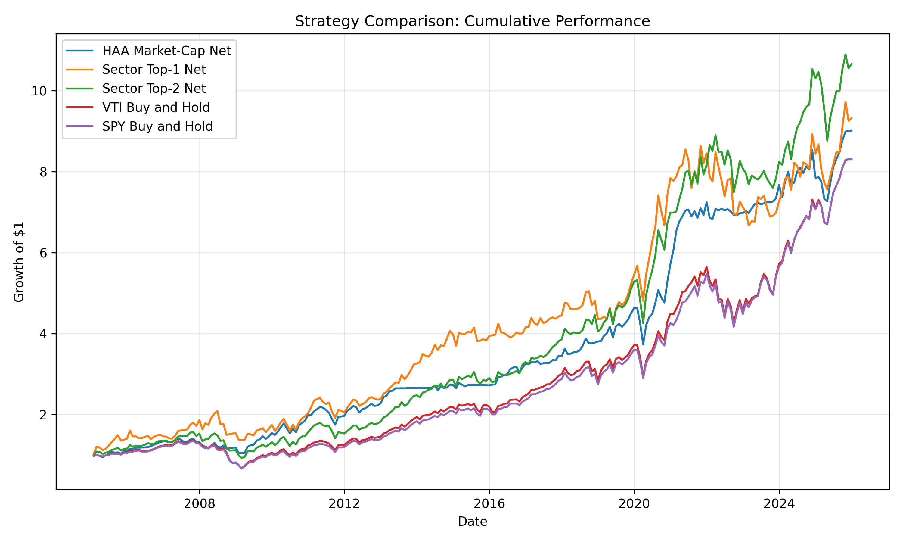
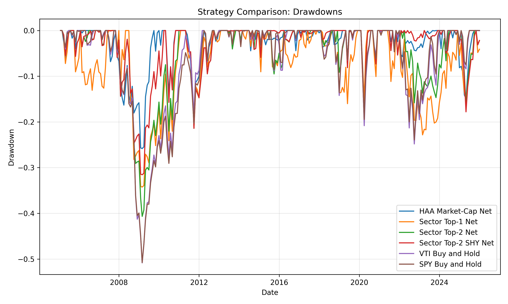
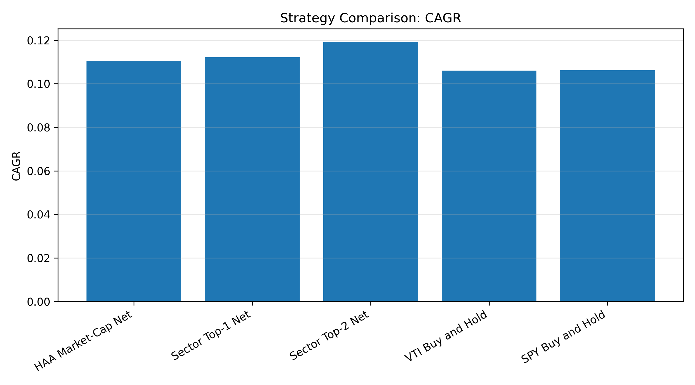
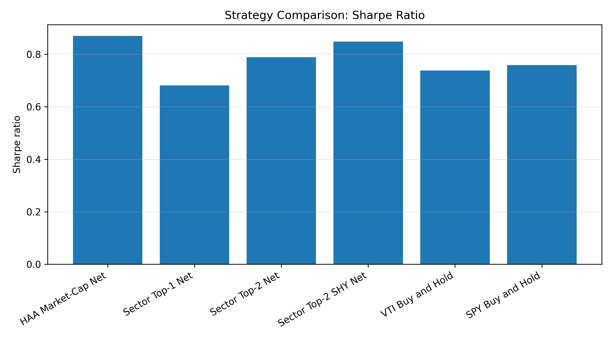
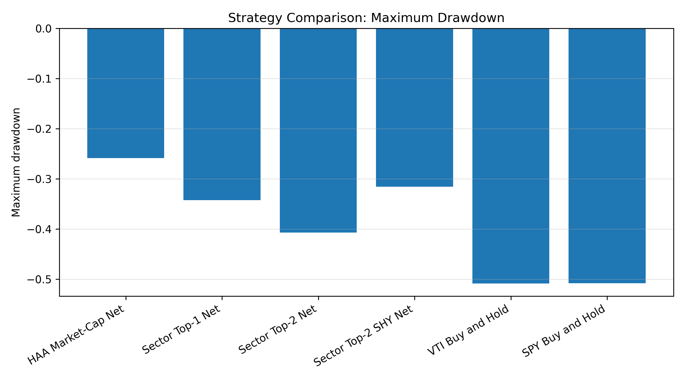
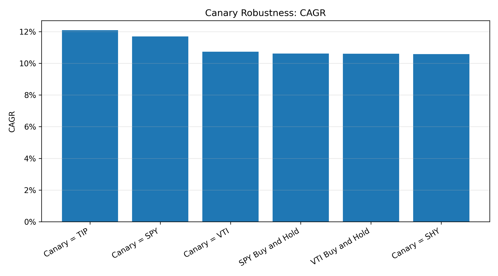
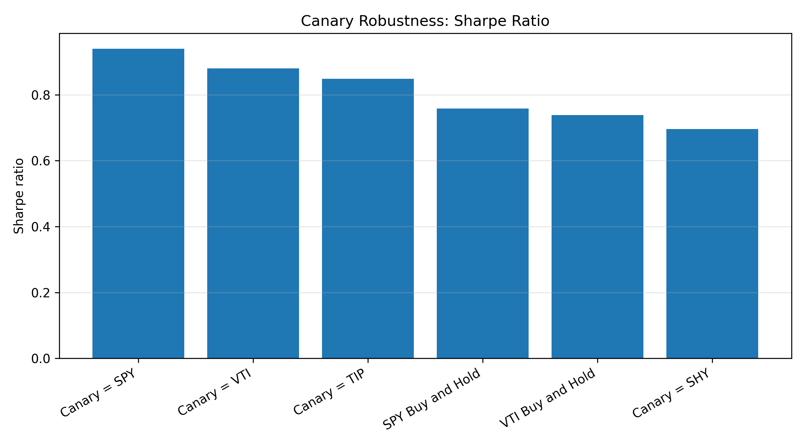
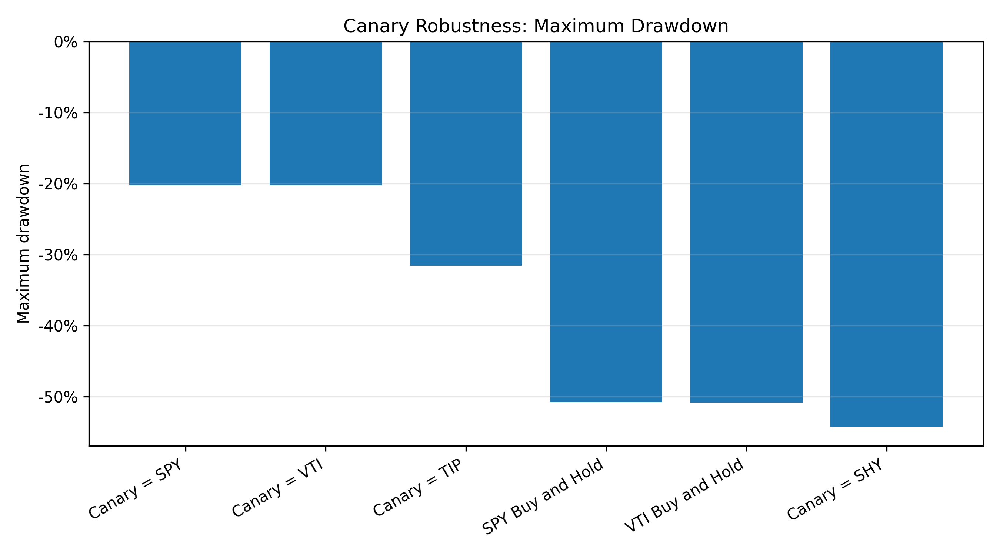
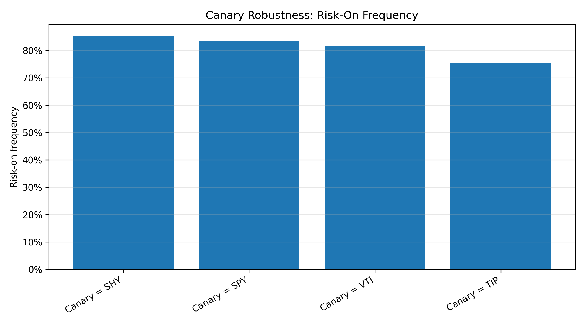

# Regime-Aware Sector Rotation with Momentum and Canary Assets

This project studies a regime-aware asset allocation framework based on momentum signals and canary assets.

The first part replicates a Hybrid Asset Allocation-style market-cap rotation strategy using:

* `TIP` as a canary asset;
* `SPY`, `MDY`, and `IJR` as offensive assets;
* `SHY` as the defensive asset;
* `VTI` as the benchmark.

The second part extends the framework to sector rotation. Instead of rotating between market-cap ETFs, the strategy rotates between sector ETFs and tests whether sector-level momentum improves performance.

The final part runs a robustness analysis on the choice of canary asset.

---

## 1. Research Question

The project asks:

> Can a regime-aware momentum strategy improve risk-adjusted performance and drawdown control compared with a buy-and-hold equity benchmark?

More specifically:

1. Can we replicate a HAA-style market-cap rotation strategy?
2. Does extending the framework to sector rotation improve performance?
3. Does a more defensive risk-off allocation improve drawdown control?
4. How sensitive are the results to the choice of canary asset?

---

## 2. Strategy Logic

### 2.1 Momentum Signal

The core signal is a 13612 momentum score:

[
M_t = \frac{1}{4}(R_{1m,t} + R_{3m,t} + R_{6m,t} + R_{12m,t}),
]

where (R_{h,t}) is the trailing total return over (h) months.

The signal is computed at month-end and applied to the following month to avoid look-ahead bias.

---

### 2.2 Canary Asset

A canary asset is used as a regime proxy.

If the canary momentum is positive, the strategy is in a risk-on regime:

[
M_t(\text{canary}) > 0.
]

If the canary momentum is non-positive, the strategy is in a risk-off regime:

[
M_t(\text{canary}) \leq 0.
]

The baseline canary is `TIP`, following the HAA-style framework.

---

## 3. Strategies Tested

### 3.1 HAA Market-Cap Replication

The replication strategy follows this logic:

* Risk-on: invest 100% in the strongest asset among `SPY`, `MDY`, and `IJR`.
* Risk-off: invest 100% in `SHY`.

This gives a close qualitative replication of the HAA-style market-cap rotation framework.

---

### 3.2 Sector Rotation Top-1

The first sector extension uses:

* Offensive sectors: `XLK`, `XLY`, `XLI`, `XLF`, `XLE`;
* Defensive assets: `XLP`, `XLU`, `XLV`, `SHY`.

The strategy is:

* Risk-on: invest 100% in the strongest offensive sector.
* Risk-off: invest 100% in the strongest defensive asset.

---

### 3.3 Sector Rotation Top-2

The second extension reduces concentration:

* Risk-on: invest 50% in each of the top two offensive sectors.
* Risk-off: invest 50% in each of the top two defensive assets.

This diversification improves the risk-return profile relative to the Top-1 sector strategy, but it remains exposed to equity drawdowns.

---

### 3.4 Sector Top-2 SHY

The best-performing extension is more defensive:

* Risk-on: invest 50% in each of the top two offensive sectors.
* Risk-off: invest 100% in `SHY`.

This variant keeps the return potential of sector momentum while improving drawdown control.

---

## 4. Main Results

Backtest period: January 2005 to December 2025.
Frequency: monthly.
Transaction costs: 5 basis points.

| Strategy             | Total Return |   CAGR | Volatility | Sharpe | Max Drawdown | Avg. Turnover |
| -------------------- | -----------: | -----: | ---------: | -----: | -----------: | ------------: |
| HAA Market-Cap Net   |      801.56% | 11.04% |     13.06% |   0.87 |      -25.83% |        35.32% |
| Sector Top-1 Net     |      832.74% | 11.22% |     18.06% |   0.68 |      -34.25% |        44.05% |
| Sector Top-2 Net     |      965.97% | 11.93% |     15.97% |   0.79 |      -40.67% |        32.94% |
| Sector Top-2 SHY Net |      998.13% | 12.09% |     14.79% |   0.85 |      -31.56% |        28.77% |
| VTI Buy and Hold     |      730.20% | 10.60% |     15.31% |   0.74 |      -50.84% |             — |
| SPY Buy and Hold     |      731.68% | 10.61% |     14.81% |   0.76 |      -50.78% |             — |

---

## 5. Interpretation

The HAA market-cap replication delivers the strongest defensive profile. It has the highest Sharpe ratio among the baseline strategies and the lowest maximum drawdown.

The sector rotation extensions generate higher returns, but the first versions introduce more volatility and sector concentration.

The best extension is `Sector Top-2 SHY Net`. It achieves:

* the highest CAGR;
* a Sharpe ratio close to the HAA market-cap strategy;
* lower volatility than the other sector variants;
* significantly lower drawdown than buy-and-hold equity benchmarks;
* the lowest turnover among the dynamic strategies.

The main trade-off is clear:

> HAA market-cap protects better, while Sector Top-2 SHY generates more return with a still reasonable defensive profile.

---

## 6. Strategy Comparison Figures

### Cumulative Performance



### Drawdowns



### CAGR



### Sharpe Ratio



### Maximum Drawdown



---

## 7. Canary Robustness

The project also tests whether the `Sector Top-2 SHY` strategy is sensitive to the choice of canary asset.

The tested canaries are:

* `TIP`;
* `SPY`;
* `VTI`;
* `SHY`.

| Canary |   CAGR | Volatility | Sharpe | Max Drawdown | Risk-On Frequency |
| ------ | -----: | ---------: | -----: | -----------: | ----------------: |
| TIP    | 12.09% |     14.79% |   0.85 |      -31.56% |            75.40% |
| SPY    | 11.69% |     12.67% |   0.94 |      -20.25% |            83.33% |
| VTI    | 10.72% |     12.50% |   0.88 |      -20.25% |            81.75% |
| SHY    | 10.58% |     16.46% |   0.70 |      -54.21% |            85.32% |

The robustness test shows that the strategy is sensitive to the regime proxy.

`TIP` is the most paper-aligned canary and produces the highest CAGR.
`SPY` gives the best Sharpe ratio and drawdown control.
`SHY` performs poorly as a canary, even though it is useful as a defensive asset.

This suggests that a defensive asset is not necessarily a good regime proxy.

---

## 8. Canary Robustness Figures

### CAGR by Canary



### Sharpe Ratio by Canary



### Maximum Drawdown by Canary



### Risk-On Frequency by Canary



---

## 9. Repository Structure

```text
regime-aware-sector-rotation/
├── README.md
├── requirements.txt
├── data/
├── figures/
├── notebooks/
│   ├── 01_haa_replication.ipynb
│   └── 02_sector_rotation_extension.ipynb
├── report/
└── src/
    ├── common/
    │   ├── data.py
    │   ├── metrics.py
    │   └── plots.py
    └── haa/
        ├── momentum.py
        ├── replication.py
        ├── sector_rotation.py
        ├── sector_rotation_topk.py
        ├── sector_rotation_top2_shy.py
        ├── compare_strategies.py
        ├── robustness_canary.py
        └── plot_robustness_canary.py
```

---

## 10. How to Run

### 10.1 Install Dependencies

```bash
pip install -r requirements.txt
```

### 10.2 Download Data

```bash
python src/common/data.py
```

This downloads daily and monthly ETF prices and saves:

```text
data/daily_prices.csv
data/monthly_prices.csv
```

### 10.3 Run the HAA Market-Cap Replication

```bash
python src/haa/replication.py
```

### 10.4 Run Sector Rotation Strategies

```bash
python src/haa/sector_rotation.py
python src/haa/sector_rotation_topk.py
python src/haa/sector_rotation_top2_shy.py
```

### 10.5 Compare Strategies

```bash
python src/haa/compare_strategies.py
```

### 10.6 Run Canary Robustness Tests

```bash
python src/haa/robustness_canary.py
python src/haa/plot_robustness_canary.py
```

---

## 11. Data

The project uses ETF price data downloaded with `yfinance`.

The main assets are:

| Ticker | Role                                        |
| ------ | ------------------------------------------- |
| `TIP`  | Baseline canary asset                       |
| `SPY`  | Large-cap equity ETF and alternative canary |
| `MDY`  | Mid-cap equity ETF                          |
| `IJR`  | Small-cap equity ETF                        |
| `SHY`  | Defensive asset                             |
| `VTI`  | Total U.S. equity market benchmark          |
| `XLK`  | Technology sector                           |
| `XLY`  | Consumer discretionary sector               |
| `XLI`  | Industrials sector                          |
| `XLF`  | Financials sector                           |
| `XLE`  | Energy sector                               |
| `XLP`  | Consumer staples sector                     |
| `XLU`  | Utilities sector                            |
| `XLV`  | Health care sector                          |

---

## 12. Methodological Notes

The backtests use monthly data.

Signals are computed at the end of each month and applied to the following month. This avoids look-ahead bias.

Transaction costs are applied using one-way portfolio turnover:

[
\text{turnover}*t = \frac{1}{2} \sum_i |w*{t,i} - w_{t-1,i}|.
]

Net returns are computed as:

[
r^{net}_t = r^{gross}_t - c \times \text{turnover}_t,
]

where (c) is the transaction cost rate.

---

## 13. Limitations

This project is a research and educational backtest. It has several limitations:

* ETF data are downloaded from `yfinance`, which may differ from institutional total-return datasets.
* The strategy ignores taxes, bid-ask spreads, market impact, and management fees beyond simple transaction costs.
* The universe is limited to liquid ETFs.
* The sector rotation strategy is concentrated and may be sensitive to sector definitions.
* The canary signal is a simple binary momentum filter.
* Results are historical and should not be interpreted as investment advice.

---

## 14. Possible Extensions

Potential extensions include:

1. Markov-smoothed regime probabilities instead of a binary risk-on / risk-off signal.
2. Top-3 or volatility-scaled sector allocation.
3. Rolling out-of-sample parameter validation.
4. Alternative canaries, such as credit spreads, Treasury yield slopes, or macro indicators.
5. Comparison with classic trend-following and dual momentum strategies.
6. Stress-period analysis around 2008, 2020, and 2022.

---

## 15. Disclaimer

This repository is for educational and research purposes only.
It is not investment advice.
